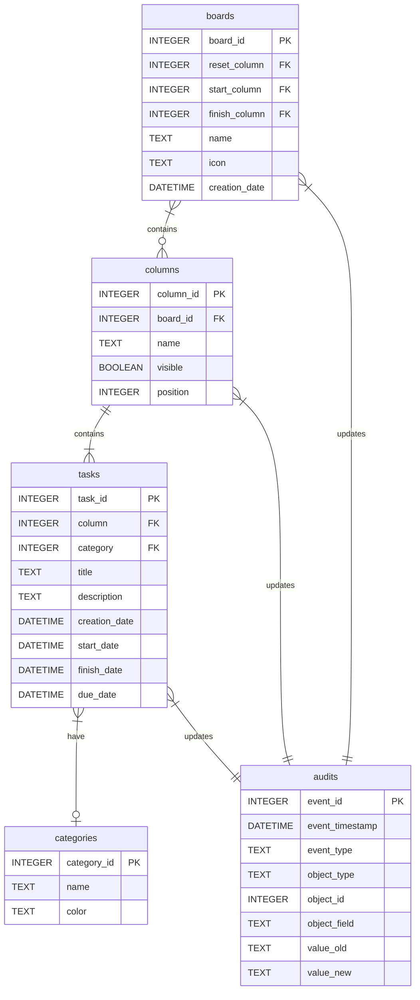

<!-- Icons -->
[](https://github.com/astral-sh/ruff)
[](https://pypi.org/project/kanban-tui/)
[](https://pypi.python.org/pypi/kanban-tui)
[](https://opensource.org/licenses/MIT)
[](https://pepy.tech/project/kanban-tui)
[](https://coveralls.io/github/Zaloog/kanban-tui?branch=main)

# kanban-tui

kanban-tui is a customizable task manager in the terminal.
Now also supporting agentic usage (check the [skill command](#create-or-update-agent-skillmd-file) for more infos).

<!--  -->

## Demo GIF


If you want to test `kanban-tui` you can directly run this demo yourself with the help of [uv] using `uvx` with

```bash
uvx kanban-tui demo
```

## Features
Expand for more detailed information

</details>
<details><summary>Following the XDG basedir convention</summary>

kanban-tui utilizes [pydantic-settings] and [xdg-base-dirs] `user_config_dir` to save
the config file and `user_data_dir` for the sqlite database.
You can get an overview of all file locations with `uvx kanban-tui info`
</details>

</details>
<details><summary>Customizable Board</summary>

kanban-tui comes with four default columns
(`Ready`, `Doing`, `Done`, `Archive`) but can be customized to your needs.
More columns can be created via the `Settings`-Tab. Also the visibility and order of columns can be adjusted.
Deletion of existing columns is only possible, if no task is present in the column you want to delete.
</details>

</details>
<details><summary>Multi Board Support</summary>

With version v0.4.0 kanban-tui allows the creation of multiple boards.
Use `B` on the `Kanban Board`-Tab to get an overview over all Boards including
the amount of columns, tasks and the earliest Due Date.
</details>

</details>
<details><summary>Task Management</summary>

When on the `Kanban Board`-Tab you can `create (n)`, `edit (e)`, `delete (d)` or `move (H, L)` tasks between columns.
Movement between columns also supports drag and drop via mouse.
</details>

</details>
<details><summary>Database Information</summary>
The current database schema looks as follows.
The Audit table is filled automatically based on triggers.


</details>

</details>
<details><summary>Visual Summary</summary>

To give you an overview over the amount of tasks you `created`, `started` or `finished`, kanban-tui
provides an `Overview`-Tab to show you a bar-chart on a `monthly`, `weekly` or `daily` scale.
It also can be changed to a stacked bar chart per category.
This feature is powered by the [plotext] library with help of [textual-plotext].
</details>

## Installation

You can install `kanban-tui` with one of the following options:

```bash
# not recommended
pip install kanban-tui
```

```bash
pipx install kanban-tui
```

```bash
uv tool install kanban-tui
```
I recommend using [pipx] or [uv] to install CLI Tools into an isolated environment.

To be able to use `kanban-tui` in your browser with the `--web`-flag, the optional dependency
`textual-serve` is needed. You can add this to `kanban-tui` by installing the optional `web`-dependency
with the installer of your choice, for example with [uv]:

```bash
uv tool install 'kanban-tui[web]'
```


## Usage
kanban-tui now also supports the `kanban-tui` entrypoint besides `ktui`.
This was added to support easier installation via [uv]'s `uvx` command.

### Normal Mode
Starts `kanban-tui` with a starting board. The application can be closed by pressing `ctrl+q`.
Pass the `--web` flag and follow the shown link to open `kanban-tui` in your browser.
```bash
ktui
```

### Demo Mode
Creates a temporary Config and Database which is populated with example Tasks to play around.
Kanban-Tui will delete the temporary Config and Database after closing the application.
Pass the `--clean` flag to start with an empty demo app.
Pass the `--keep` flag to tell `kanban-tui` not to delete the temporary Database and Config.
Pass the `--web` flag and follow the shown link to open `kanban-tui` in your browser.

```bash
ktui demo
```

### Clear Database and Configuration
If you want to start with a fresh database and configuration file, you can use this command to
delete your current database and configuration file.

```bash
ktui clear
```

### Create or Update Agent SKILL.md File
With version v0.11.0 kanban-tui offers a [CLI Interface](#cli-interface-to-manage-tasks) to manage tasks, boards and columns.
This is targeted mainly for agentic e.g. via [Claude][claude-code] use, because references will be made only by ids, but some commands
are also ergonomic for human use (e.g. task creation).

```bash
ktui skill init/update
```

### CLI Interface to manage Tasks
The commands to manage tasks, boards and columns via the CLI are all build up similarly. For detailed overview of arguments
and options please use the `--help` command.
Note that not every functionality is supported yet (e.g. category management, column customisation).

```bash
ktui task list/create/update/move/delete
ktui board list/create/delete/activate
ktui columns list
```

### Show Location of Data, Config and Skill Files
`kanban-tui` follows the [XDG] basedir-spec and uses the [xdg-base-dirs] package to get the locations for data and config files.
You can use this command to check where the files are located, that `kanban-tui` creates on your system.

```bash
ktui info
```

## Feedback and Issues
Feel free to reach out and share your feedback, or open an [Issue],
if something doesn't work as expected.
Also check the [Changelog] for new updates.


<!-- Repo Links -->
[Changelog]: https://github.com/Zaloog/kanban-tui/blob/main/CHANGELOG.md
[Issue]: https://github.com/Zaloog/kanban-tui/issues


<!-- external Links Python -->
[textual]: https://textual.textualize.io
[pipx]: https://github.com/pypa/pipx
[PyPi]: https://pypi.org/project/kanban-tui/
[plotext]: https://github.com/piccolomo/plotext
[textual-plotext]: https://github.com/Textualize/textual-plotext
[xdg-base-dirs]: https://github.com/srstevenson/xdg-base-dirs
[pydantic-settings]: https://pypi.org/project/pydantic-settings/

<!-- external Links Others -->
[XDG]: https://specifications.freedesktop.org/basedir-spec/basedir-spec-latest.html
[uv]: https://docs.astral.sh/uv
[claude-code]: https://code.claude.com/docs/en/overview
